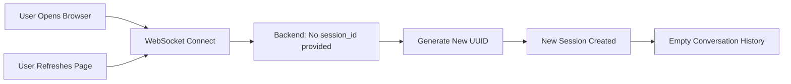

# Session Management & Conversation History

## How Sessions Work Currently

### Session Lifecycle

**Current Behavior: Session refreshes on every browser refresh/reconnect**



### Technical Details

1. **Frontend (`AgentVoiceButton.tsx`):**
   - Does **NOT** pass a `session_id` parameter in the WebSocket URL
   - Every connection = fresh start
   - No localStorage persistence

2. **Backend (`orchestrator.py`):**
   ```python
   def __init__(self, db: Session, session_id: str | None = None):
       self.db = db
       self.session_id = session_id or str(uuid.uuid4())  # <-- generates random UUID
   ```
   - If no `session_id` is provided, generates a random UUID
   - Each session has its own isolated conversation history

3. **WebSocket Connection (`agent.py`):**
   ```python
   session_id = dict(websocket.query_params).get("session_id")
   agent = TaskAgent(db, session_id=session_id)
   ```
   - Extracts `session_id` from query params (currently always `None`)
   - Passes to agent initialization

### Conversation History Loading

**Automatic Injection (NOT explicitly requested):**

```python
def process_query(self, user_query: str, conversation_history: list[dict] | None = None):
    # Load conversation history from database if not provided
    if conversation_history is None:
        conversation_history = self._load_conversation_history()  # <-- AUTO-LOADED
    
    # Save user query to database
    self._save_message(role="user", content=user_query)
    
    # Build messages from conversation history
    messages = conversation_history.copy() if conversation_history else []
    messages.append({"role": "user", "content": user_query})
```

**Key Points:**
- ✅ **Automatic**: History is loaded on EVERY query without agent asking
- ✅ **Session-filtered**: Only loads messages from current session
- ✅ **Last 5 messages**: Default limit prevents context bloat
- ✅ **Includes tool calls**: Full context with tool usage

### Database Storage

**Schema (`ConversationMessage`):**
```python
class ConversationMessage(Base):
    id: int
    session_id: str           # <-- Groups messages by session
    role: str                 # "user" or "assistant"
    content: str              # Message text
    tool_calls: str | None    # JSON string of tool calls
    tool_results: str | None  # JSON string of tool results
    created_at: datetime      # Timestamp
```

---

## New Feature: `load_full_history` Tool

### Purpose
When the agent is **confused** or user references **previous sessions**, the agent can now explicitly load cross-session history.

### Use Cases
- User says: *"Remember what we talked about earlier?"*
- User says: *"Continue from yesterday"*
- User says: *"What were we working on?"*
- Agent is missing context that might be in a previous session

### Tool Definition
```python
{
    "name": "load_full_history",
    "description": "Load recent conversation history across ALL sessions (no session filter).",
    "input_schema": {
        "type": "object",
        "properties": {
            "limit": {
                "type": "integer",
                "description": "Number of recent messages to load (default: 5, max: 20)",
                "default": 5,
            },
        },
    },
}
```

### Implementation
```python
def _load_full_history(db: Session, limit: int = 5) -> dict[str, Any]:
    """
    Load recent conversation history across ALL sessions (no filtering).
    Returns a summary of recent conversations for context.
    """
    messages = (
        db.query(ConversationMessage)
        .order_by(ConversationMessage.created_at.desc())
        .limit(limit)
        .all()
    )
    
    history_summary = []
    for msg in messages:
        msg_data = {
            "role": msg.role,
            "content": msg.content[:200] + "...",  # Truncate long messages
            "session_id": msg.session_id,
            "created_at": msg.created_at.isoformat(),
        }
        
        if msg.tool_calls:
            msg_data["tools_used"] = [tc.get("name") for tc in tool_calls]
        
        history_summary.append(msg_data)
    
    return {
        "success": True,
        "history": history_summary,
        "note": "This history spans multiple sessions",
    }
```

### Example Usage

**User Query:**
> "What was I working on yesterday?"

**Agent Response:**
```json
[
  {
    "type": "tool_use",
    "tool": "load_full_history",
    "input": {"limit": 10}
  }
]
```

**Tool Result:**
```json
{
  "success": true,
  "history": [
    {
      "role": "user",
      "content": "Add task: Finish onboarding redesign",
      "session_id": "abc-123",
      "created_at": "2025-11-18T10:30:00",
      "tools_used": ["create_task"]
    },
    {
      "role": "assistant",
      "content": "I've added the task...",
      "session_id": "abc-123",
      "created_at": "2025-11-18T10:30:05"
    }
  ]
}
```

**Agent Answer:**
> "Yesterday you were working on the onboarding redesign. I can see you created a task for it. Would you like to continue with that?"

---

## Making Sessions Persistent Across Refreshes

### Current Issue
Every browser refresh creates a **new session** with **empty history**.

### Solution: Store session_id in localStorage

#### Frontend Changes Needed

**1. Generate/Retrieve Session ID (`AgentVoiceButton.tsx`):**
```typescript
// At the top of the component
const [sessionId] = useState(() => {
  // Try to get existing session from localStorage
  const stored = localStorage.getItem('agent_session_id');
  if (stored) return stored;
  
  // Generate new UUID and store it
  const newId = crypto.randomUUID();
  localStorage.setItem('agent_session_id', newId);
  return newId;
});
```

**2. Pass session_id in WebSocket URL:**
```typescript
const handleStart = useCallback(async () => {
  const params = new URLSearchParams({
    model: 'flux-general-en',
    sample_rate: '16000',
    encoding: 'linear16',
    eot_threshold: '0.9',
    session_id: sessionId,  // <-- ADD THIS
  });

  const ws = new WebSocket(`${baseUrl}?${params.toString()}`);
  // ... rest of the code
}, [sessionId]);
```

**3. Optional: Clear session button:**
```typescript
const clearSession = () => {
  localStorage.removeItem('agent_session_id');
  window.location.reload();
};
```

### Benefits of Persistent Sessions
- ✅ Conversation continues across browser refreshes
- ✅ Full context maintained throughout the day
- ✅ No need to re-explain context after reload
- ✅ Better user experience for long-term task management

### When Session Should Reset
- User explicitly clicks "Clear History"
- User starts a completely new project
- User wants fresh context
- Testing/debugging

---

## Settings Page: View Full History

### Current Implementation
- **Endpoint:** `GET /api/conversation/history?session_id=<id>&limit=100`
- **Page:** `/settings` with conversation history viewer
- **Features:**
  - View messages from all sessions or filter by session
  - See user messages, agent responses, tool calls, and results
  - Clear history functionality
  - Real-time loading with proper error handling

### Access
- Click the "Settings" button in the top-right of the main UI
- Navigate to `/settings?session_id=<current_session>` to filter

---

## Summary

### Current State
| Feature | Status | Behavior |
|---------|--------|----------|
| Session persistence | ❌ **No** | New session on every refresh |
| Auto-load history (same session) | ✅ **Yes** | Last 5 messages loaded automatically |
| Cross-session history tool | ✅ **Yes** | Agent can explicitly load via `load_full_history` |
| Settings page | ✅ **Yes** | View full history across all sessions |
| Tool calls stored in DB | ✅ **Yes** | Complete conversation context preserved |

### To Enable Persistent Sessions
Implement the localStorage solution in `AgentVoiceButton.tsx` (3 small changes shown above).

### Agent Intelligence
- **Default:** Agent uses last 5 messages from current session (automatic)
- **When confused:** Agent can call `load_full_history` to see older messages across sessions
- **User request:** Settings page provides full audit trail

